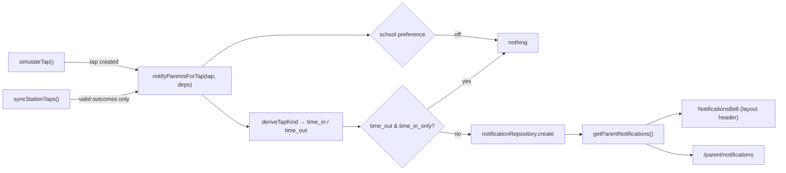

# Recipe: Step 24 — Notification feed

## What this step is for

Make Step 20's `Notification` records real: an in-app bell + feed for parents, populated whenever a tap is recorded (the same simulated-tap mechanism the staff dashboard uses), honoring each school's notification preference (`off` / `time_in_only` / `time_in_and_time_out`). SMS stays dropped (plan change of 2026-09-22) — this is the in-app channel only.

## Starting point

`Notification` records, the read-only mock `notificationRepository`, and the school `notificationPreference` field already existed (Steps 20–21). Two places record taps: `simulateTap()` (`src/features/attendance/actions.ts`) and `syncStationTaps()` (`src/features/station/station-actions.ts`). Neither created notifications.

**The seed gap:** the simulate button only taps students with no tap today *and* an active card — and every linked student was untappable (0001/0002/0038/0056 already tapped; 0037/0055 cardless). The step's own "Done when" was impossible to see without adding links to a tappable student per school (0006 Balanga, 0043 Oceanview, 0057 Crimsonridge — each the *first* student the simulate button picks there; 0006 was already deliberately untapped for the teacher demo).

## Diagram



## Checklist

1. **Add `deriveTapKind(tap, allStudentTaps)`** to `src/features/attendance/status.ts` next to `todaysTap`: count that student's same-day taps strictly before this one (`tappedAt.slice(0, 10)` equality, then `tappedAt` comparison with an `id` tiebreak so the sequence is deterministic); even count → `time_in`, odd → `time_out`. This is Phase 2's decided alternating rule applied now. Unit tests in `status.test.ts` (first/2nd/3rd tap, other-student and prior-day taps ignored, doesn't count itself, tiebreak).

2. **Add the fan-out helper** `src/features/attendance/notify-parents.ts` — repositories as parameters, not singleton imports (the `resolveSession(staffId, repository)` convention), so tests use fresh mocks:
   ```ts
   export async function notifyParentsForTap(tap: Tap, deps: NotifyParentsDeps): Promise<Notification | null> {
     if (!tap.studentId) return null;
     const school = await deps.schoolRepository.getById(tap.schoolId);
     if (!school || school.notificationPreference === "off") return null;
     const studentTaps = await deps.tapRepository.listByStudent(tap.studentId);
     const kind = deriveTapKind(tap, studentTaps);
     if (kind === "time_out" && school.notificationPreference === "time_in_only") return null;
     return deps.notificationRepository.create({
       id: crypto.randomUUID(), schoolId: tap.schoolId, studentId: tap.studentId,
       kind, tappedAt: tap.tappedAt, read: false,
     });
   }
   ```
   One notification per tap — never per parent; guardians join through their links at read time (Step 20's shared-read model). Tests cover all four preference/kind outcomes plus null-student and unknown-school skips.

3. **Wire the two call sites**, keeping `refresh()` in the actions (the helper stays `next/cache`-free):
   - `simulateTap`: `await tapRepository.create(tap);` then `await notifyParentsForTap(tap, { schoolRepository, tapRepository, notificationRepository });`
   - `syncStationTaps`: fan out **only when `outcome.kind === "valid"`** — lost-card taps raise an `Alert` (the designed response), unknown-card taps have `studentId: null`.

4. **Give the repository its two write methods** (`src/data/repositories/notification-repository.ts`): `create` (idempotent by id, like `tapRepository.create`) and `markRead(id)` (findIndex + replace returning the updated record or `null`, like `schoolRepository.update`). Four tests in `notification-repository.test.ts`.

5. **Add the seed links** in `src/data/seed/parent-student-links.ts` with a comment explaining each choice: `parent-balanga-1 → student-0006` (both), `parent-oceanview-1 → student-0043` (time-in-only), `parent-crimsonridge-1 → student-0057` (off — demonstrates suppression). Each student is that school's first simulate-button pick.

6. **Build the read path** `src/features/parents/notifications-data.ts`: `getParentNotifications(parentId)` fetches links → students and notifications in parallel, flattens, sorts `tappedAt` desc; plus `countUnreadNotifications(items)` and `notificationKindLabel(kind)` ("tapped in" / "tapped out").

7. **Add the server actions** `src/features/parents/notification-actions.ts` (`"use server"`): `markNotificationRead(id)` and `markAllNotificationsRead()`, both returning `{ ok: true } | { ok: false, formError }` (the `auth-actions.ts` convention) and gated on `getParentSession()` + link membership + a `schoolId` match. `refresh()` after the writes.

8. **Build the bell** `src/features/parents/notifications-bell.tsx` (client): `DropdownMenu` trigger = `Button variant="ghost" size="icon"` + Bell icon + an unread badge (absolute top-right, capped "9+", hidden at 0, count in the trigger's aria-label). Content `className="w-80 max-w-[calc(100vw-2rem)]"`. Header "Notifications" + "Mark all as read" (only when unread > 0), up to 5 items ("{First name} tapped in/out · 7:56 AM"), each item's `onSelect` calls `markNotificationRead` with `event.preventDefault()` so the menu stays open, footer "View all" as `DropdownMenuItem asChild` + `Link` to `/parent/notifications`, empty text when there are none. Render it in `src/app/parent/(protected)/layout.tsx`'s header next to `SignOutButton`; the layout fetches `getParentNotifications(session.parentId)` and passes items down.

9. **Build the page**: `/parent/notifications/page.tsx` (server) — `PageHeader` "Notifications" with `MarkAllReadButton` as an action only while unread > 0, then `EmptyState` (Bell icon) or `NotificationList` (client, in `src/features/parents/`): day-grouped via `formatTapDate` (export it from `child-summary-card.tsx`), unread rows are buttons with accent background + primary dot, read rows plain divs. `loading.tsx` mirrors the list's shape (day header + three rows).

10. **Write the bell test** `notifications-bell.test.tsx` with three environment facts, in order: (a) `vi.mock("./notification-actions")` so `next/cache` and repositories stay out of the component test's graph; (b) a no-op `ResizeObserver` stub — Radix's popper measures with it and jsdom lacks it; (c) open the menu with `fireEvent.pointerDown(trigger, { button: 0, ctrlKey: false })` — Radix requires `button === 0 && ctrlKey === false` and jsdom's fallback `Event` leaves `ctrlKey` *undefined* without the explicit init. Test: badge shows the count, caps at "9+", hides at 0 (trigger then has empty text content), trigger aria-label, empty text when opened, item name/kind/time text when opened.

11. **Verify all five checks** (`lint`, `typecheck`, `test`, `build`, `check:tokens`), then the browser demo: Balanga simulate → parent sees the new unread item; Oceanview simulate → time-in fires; Crimsonridge simulate → nothing fires (bell badge-less, empty feed); keyboard pass on the bell (Enter opens, arrows walk, Esc closes and returns focus). 360px and 1280px, light and dark.

12. **Write `docs/NOTIFICATIONS.md`** (subsystem doc, linked from README's project guide), the BUILD-LOG step section, the LEARNING-LOG entry, then this recipe.

13. **Tick this step's build-task checkboxes** in `docs/PLAN.md`, run `npm run progress`, then **stop and report**.

## What ended up in each file, and why

| File | What's in it | Why |
|---|---|---|
| `src/features/attendance/status.ts` | `deriveTapKind()` | Kind is derived from the tap sequence — never stored as a label on a tap ("derive, don't store"). |
| `src/features/attendance/notify-parents.ts` | `notifyParentsForTap()` | One place owns the whole preference decision; deps-injected so it's unit-testable with fresh repos. |
| `src/features/attendance/actions.ts` | Fan-out call after `tapRepository.create` | The dashboard's simulate is the primary demo path. |
| `src/features/station/station-actions.ts` | Fan-out for valid taps only | Lost taps alert instead; unknown taps have nobody to notify. |
| `src/data/repositories/notification-repository.ts` | `create` + `markRead` | The step's only data-layer additions; matches the established mock shapes. |
| `src/data/seed/parent-student-links.ts` | Three links to first-pick students | Without them the step's "Done when" was unreachable (see Starting point). |
| `src/features/parents/notifications-data.ts` | `getParentNotifications` + count + label | Two consumers (bell, page) justify the extraction; both spell "tapped in" identically. |
| `src/features/parents/notification-actions.ts` | `markNotificationRead`, `markAllNotificationsRead` | Ownership check = session + link membership + schoolId match. |
| `src/features/parents/notifications-bell.tsx` | Header bell + dropdown | The always-visible entry point; badge, 5 newest, mark-all, view-all. |
| `src/features/parents/notification-list.tsx`, `mark-all-read-button.tsx` | Day-grouped feed + page action | Unread rows are buttons (click = mark read); read rows are plain. |
| `src/app/parent/(protected)/layout.tsx` | Renders the bell; fetches once | Every parent page gets the bell without re-fetching; `refresh()` re-renders the layout, so the badge clears in place. |
| `src/app/parent/(protected)/notifications/page.tsx` + `loading.tsx` | The full feed page + skeleton | EmptyState when empty; "Mark all as read" hidden when nothing is unread. |

## Verification

`lint`, `typecheck`, `test` (283 total; 23 new: 7 deriveTapKind, 7 fan-out, 4 repository, 5 bell), `check:tokens`, `build` all green. Browser pass at 360px/1280px light/dark, zero console errors: Balanga simulate → 3 unread → bell → mark-all → badge clears → page day-grouped; Oceanview simulate → 1 unread → click row marks it read; Crimsonridge simulate → tap recorded, no notification, feed shows the empty state. Keyboard: Enter opens the bell, arrows walk items, Esc closes and focus returns.

Two dead ends the recipe skips (full story in `docs/BUILD-LOG.md` Step 24): unescaped apostrophes in JSX copy (reworded, no escape entities), and `startTransition(() => markRead(...))` returning a promise from a void-expected callback (block body).
