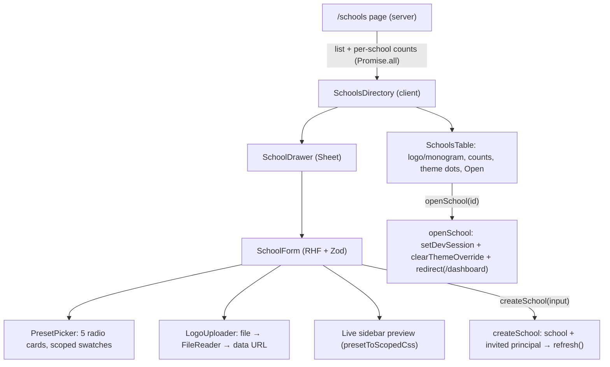

# Recipe: Step 25 — Schools management

## What this step is for

The super admin's Schools screen: list every school (with its logo, theme and counts), add a school — name, colors, principal, logo — and **Open** one to see the whole app the way that school's principal does. Owner decisions up front: "Open" = switch into the school (so the form also creates an invited principal, making brand-new schools openable right away); no Status column.

## Starting point

`/schools` was a stub ("Not built yet"). `SchoolRepository` had no `create()`. Seed schools had no logos. The dev switcher (Step 11) already knew how to switch the pretend-signed-in user, and `presetToScopedCss` (the design-system page's mechanism) already knew how to scope a preset's colors to a CSS selector — both get reused rather than reinvented.

## Diagram



## Checklist

1. **Schema first** — `src/features/schools/schemas.ts`: add `createSchoolSchema` next to `schoolSchema`:
   ```ts
   export const createSchoolSchema = z.object({
     name: z.string().trim().min(1, "Enter a school name"),
     principalFirstName: z.string().trim().min(1, "Enter the principal's first name"),
     principalLastName: z.string().trim().min(1, "Enter the principal's surname"),
     principalEmail: z.email("Enter a valid email address"),
     presetId: z.enum(presetIds),
     logoUrl: z.url().max(1_500_000, "That logo file is too large — 1 MB or smaller").optional(),
   });
   ```
   Export `CreateSchoolFormValues = z.input<...>` and `CreateSchoolFormInput = z.infer<...>` from `types.ts` (the `StudentFormValues` precedent), plus `SchoolRow = { school, studentCount, staffCount }`.

2. **Give the repository its write method** — `src/data/repositories/school-repository.ts`: `create(school: School): Promise<School>` on the interface + mock, idempotent by id (same shape as `StaffRepository.create`).

3. **Two server actions** in `src/features/schools/actions.ts` (keep Step 21's `updateNotificationPreference`):
   - `createSchool(input)`: guard `session.role === "super_admin"` → re-validate `createSchoolSchema` → `schoolRepository.create({ id: crypto.randomUUID(), name, theme: { kind: "preset", presetId }, logoUrl, showDepedLogo: false, notificationPreference: "time_in_only" })` → `staffRepository.create({ id: crypto.randomUUID(), schoolId, role: "principal", firstName, lastName, email, status: "invited" })` (the `inviteStaff` shape) → `refresh()`. Field errors mapped from the ZodError with the same flatten helper the staff actions use.
   - `openSchool(schoolId)`: guard super_admin → `staffRepository.listBySchool(schoolId)` → first principal, or `{ ok: false, formError }` → `setDevSession(principal.id)` + `clearThemeOverride()` + `redirect("/dashboard")` (redirect stays outside any try — it throws `NEXT_REDIRECT` by design).

4. **The list** — `src/features/schools/schools-table.tsx`: School column = `SchoolLogo` + name; counts right-aligned `tabular-nums`; Theme cell = custom → brand dot, preset → light+dark primary dots from the preset object (inline style, not a class — keeps `check:tokens` green) + name; Notifications = `NOTIFICATION_PREFERENCE_LABEL[...]` (exported from `notification-settings-form.tsx`); Open = button running `openSchool` in a `useTransition` (only failure toasts). Wrap in `overflow-x-auto rounded-lg border border-border` (the "tables scroll in their container" rule).

5. **The directory + drawer** — `schools-directory.tsx` (client owner: `PageHeader` with "Add school" action, `EmptyState` or the table, owns drawer state — the `staff-directory` shape), `school-drawer.tsx` (thin Sheet chrome, form mounted only while open so it's blank each time).

6. **The form** — `src/features/schools/school-form.tsx`: `useForm<CreateSchoolFormValues, unknown, CreateSchoolFormInput>` + `zodResolver`; `busy = isPending || isSubmitting`; submit runs `startTransition(() => createSchool(data))`, toasts on success and calls `onSuccess()`. Sections: **Live preview** (a mini sidebar header — `SchoolLogo` + watched name + "Attendance portal" — inside `[data-school-form-preview]`, recolored per render by `presetToScopedCss(getThemePreset(presetId), PREVIEW_SELECTOR)` in a `<style dangerouslySetInnerHTML>`); **School details** (name, `LogoUploader`); **Colors** (`PresetPicker`); **Principal** (first/surname side by side, email). The scrollable body is `flex flex-1 flex-col gap-6 overflow-y-auto p-4` inside a `flex flex-1 flex-col overflow-hidden` form, with a pinned `SheetFooter`.

7. **The preset picker** — `src/features/schools/preset-picker.tsx`: one module-level `PREVIEW_CSS` style block holding `presetToScopedCss(preset, '[data-preset-swatch="<id>"]')` for all five presets; a `RadioGroup` of cards, each with `RadioGroupItem` + `Label` containing the name and a swatch span (`data-preset-swatch`, four chips: `bg-primary`, `bg-accent`, `bg-background`, `bg-highlight`). Two classes that matter (see "Dead ends"): the grid is `grid-cols-1 sm:grid-cols-2`, and the label carries `items-start`.

8. **The logo uploader** — `src/features/schools/logo-uploader.tsx`: sr-only input, `accept="image/*"`, `FileReader.readAsDataURL` → `onChange(dataUrl)`; `handleFile` rejects non-`image/*` ("Choose an image file (PNG, JPG or similar)") and files over `MAX_LOGO_BYTES = 1_000_000` ("That logo is larger than 1 MB — choose a smaller one") via `onInvalid`; preview `next/image` 48×48 + Replace/Remove; input value reset after every change. Export `MAX_LOGO_BYTES`.

9. **Logo everywhere else** — `school-logo.tsx` (`SchoolLogo`: logo image or `bg-primary` initials monogram; decorative `alt=""` since the name sits beside it) and `src/components/app-shell/sidebar.tsx`'s `SidebarBrand` (render the logo instead of the `SchoolIcon` badge; replace the stale "Step 20" comment).

10. **The page** — `src/app/(app)/schools/page.tsx`: `hasNavAccess(session.role, "schools")` → `AccessDenied`; then `schoolRepository.list()` + per-school counts via `Promise.all` of `studentRepository.listBySchool` / `staffRepository.listBySchool`; render `SchoolsDirectory`. No `NoSchoolSelected` guard here — a super admin is school-less by design and this is the one screen that's about all of them.

11. **Tests** — `schemas.test.ts`: +6 `createSchoolSchema` cases (valid, missing name, missing principal names, bad email, oversize logo). `school-repository.test.ts`: +2 (`create` appends; idempotent on same id).

12. **Verify all five checks** (`lint`, `typecheck`, `test`, `build`, `check:tokens`), then the browser demo (below), then the docs (BUILD-LOG section, LEARNING-LOG entries, COMPONENTS.md section, this recipe), tick PLAN.md, `npm run progress`, **stop and report**.

## What ended up in each file, and why

| File | What's in it | Why |
|---|---|---|
| `src/features/schools/schemas.ts` | `createSchoolSchema` | Shared by the form and the action — "validated on both sides" in one object. |
| `src/features/schools/types.ts` | `CreateSchoolFormValues/Input`, `SchoolRow` | The `z.input`/`z.infer` split follows the student-form precedent; `SchoolRow` keeps the page's data shape named. |
| `src/features/schools/actions.ts` | `createSchool`, `openSchool` | All Phase-1 mutations live in server actions; `openSchool` deliberately reuses the dev-switcher's swap instead of a new mechanism. |
| `src/data/repositories/school-repository.ts` | `create()` | Phase 2 swaps the mock for a real DB behind this same interface. |
| `src/features/schools/preset-picker.tsx` | 5 radio cards with scoped swatches | Preset colors stay in `presets.ts`; the picker only re-scopes them (no raw colors). |
| `src/features/schools/logo-uploader.tsx` | file → data URL | Phase 1 has no storage; the logo rides in the form values. Client checks + schema re-check. |
| `src/features/schools/school-form.tsx` | RHF/Zod form + live preview | The Step 15/18 form pattern; the preview answers "what will it look like" before saving. |
| `src/features/schools/school-logo.tsx`, `sidebar.tsx` | logo-or-initials rendering | One component for the choice everywhere outside the sidebar; the sidebar matches inline. |
| `src/features/schools/schools-table.tsx`, `schools-directory.tsx`, `school-drawer.tsx`, `page.tsx` | list + drawer + page | The Step 14/18 server-page + client-directory + Sheet shape, super-admin-gated. |

## Dead ends and the corrected answers

1. **Plain `` for data-URL logos** — planned because next/image's optimizer can't touch data URLs. Checked the installed Next source instead (`node_modules/next/dist/shared/lib/get-img-props.js`): a `data:` source automatically sets `unoptimized` and disables lazy loading, so `next/image` handles data URLs on its own. All three render sites use `next/image` with explicit `width`/`height` — lint clean.

2. **`w-full sm:max-w-lg` on the drawer did nothing** — the sheet base's `data-[side=right]:w-3/4` and `data-[side=right]:sm:max-w-sm` win over plain utilities (tailwind-merge doesn't merge across modifier groups; the attribute selector outranks a plain class). Measured: 259px at a 360px viewport, 384px at desktop — identical to the staff drawer, which has the same overridden classes. Corrected answer: pass no width classes; the comment states the real behavior, and a real width change belongs in `sheet.tsx` once.

3. **Preset cards cramped and centered at 360px** — the shadcn `Label` base ships `items-center`; adding `flex-col` stacked the name over the swatch but left them centered, and the 74px swatch overflowed its 49px label box (measured: swatch right edge 203.9px vs card edge 204.6px). Corrected answer: `grid-cols-1 sm:grid-cols-2` (the notification form's single-column precedent) + explicit `items-start` on the label. Re-measured at both breakpoints: swatch fully inside the card, left-aligned with the name.

## Browser verification script (what "done" looked like)

1. `/schools` as a principal → `AccessDenied`. Switch to **Super admin, Juan Cruz** via the dev switcher.
2. List shows the 3 seed schools with counts, theme names/dots and Open buttons.
3. Add school: submit empty → inline errors ("Enter a school name", "Enter a valid email address"); pick Crimson → live-preview monogram computes to `oklch(0.37 0.149 25)` (the preset's real primary); dispatch a `text/plain` file → "Choose an image file…"; a 1.1 MB PNG → "larger than 1 MB…"; upload `design/assets/balsci-logo.jpg` → Replace/Remove appear.
4. Create "Rizal Memorial High School" (Crimson) → toast "was added", drawer closes, row appears: 0 students, 1 staff (the invited principal), logo rendering from its data URL.
5. Open the row → lands on `/dashboard`; `--primary` on `<html>` is the crimson token (server-side); sidebar shows the logo + school name; dev switcher lists "Principal, Maria Santos (invited)" under the new school. Switch back to Super admin.
6. At 360px: no page overflow, the table scrolls inside its container, the drawer's form scrolls with a pinned footer. Dark mode (via `localStorage.theme = "dark"` + reload — the per-user toggle is Step 26): dark tokens on page, drawer and swatches. Zero console errors throughout.

## Docs to update before reporting

`docs/BUILD-LOG.md` (Step 25 section with the two layout conflicts), `docs/LEARNING-LOG.md` (data-URL logos under "Next.js as a full-stack framework"; "Open a school" under "App shell and navigation"; the two quiet CSS wins under "CSS layout: Flexbox spacing gotchas"), `docs/COMPONENTS.md` (the logo upload/render pattern + the Sheet width behavior). No new subsystem doc — the logo pattern extends the existing component-library doc.
