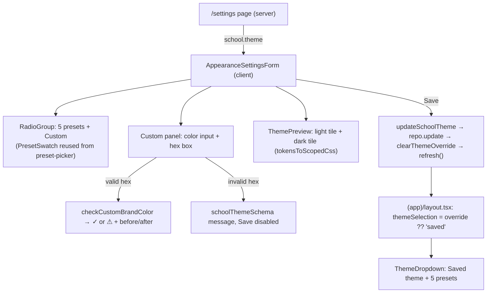

# Recipe: Step 26, Appearance settings

## What this step is for

Settings > Appearance, for principals and super admins. It has a gallery of the five theme presets plus "Custom" (one brand color with a full palette generated from it), a light and dark live preview, a contrast check that shows any correction it makes, and Save, which writes to the school record so every user at that school gets the theme on their next load. The owner also approved fixing the top-bar theme dropdown in the same step: it gets a "Saved theme" option, because it couldn't represent a saved custom color.

## Starting point

Almost all the machinery already existed:
- `school.theme` is a `{ kind: "preset" } | { kind: "custom", brandColor }` union (Step 8), validated by `schoolThemeSchema`.
- `generateCustomPalette` builds an AA-safe palette from one color (Step 5).
- `(app)/layout.tsx` renders the school's resolved theme server-side on every request (Step 11).
- The top-bar dropdown previews presets through a cookie (Step 11).
- Step 25's `preset-picker.tsx` shows each preset's swatch through `presetToScopedCss`.

What was missing was a way to *write* `school.theme` and a screen to do it from.

## Diagram



## Checklist

1. **Theme data**: in `src/lib/theme/presets.ts`, under `DEFAULT_THEME_PRESET_ID`:
   ```ts
   export const DEFAULT_CUSTOM_BRAND_COLOR = "#223060";
   export type ThemeSelection = ThemePresetId | "saved";
   ```
   The default color lives here because `check:tokens` only allows color literals in `src/lib/theme/` and `src/styles/`.

2. **Scoped CSS helpers**: in `src/lib/theme/apply-preset.ts`:
   - Loosen `presetToScopedCss(preset: ResolvedThemeTokens, selector)`, so it takes any `{ light, dark }` and not only `ThemePreset`. Drop the now-unused `ThemePreset` import.
   - Add:
     ```ts
     export function tokensToScopedCss(tokens: ThemeColorTokens, selector: string): string {
       return `${selector}{${declarationsFor(tokens)}}`;
     }
     ```
   - Test: the output starts with the selector, contains `--primary: …;`, and has no `.dark`.

3. **Contrast report**: in `src/lib/theme/contrast.ts`, add `checkCustomBrandColor(brandColor)`. It generates the palette and returns `{ buttonColor: light.primary, buttonTextColor: light.primaryForeground, ratio, adjusted }`, where `adjusted` is true when the OKLCH lightness of the brand and the button color differ by more than `0.02`. Tests:
   - `#223060` gives `adjusted` false and AA.
   - `#F9E321` gives `adjusted` true, AA, and a button darker than the input.
   - `#FFFFFF` gives `adjusted` true and AA.
   - `"not a color"` throws.

4. **Server action**: in `src/features/schools/actions.ts`, add `AppearanceSettingsActionResult` and `updateSchoolTheme(theme: SchoolTheme)`. The steps in order:
   1. Guard: `!session.schoolId || role === "teacher"` gives a "no permission" error.
   2. `schoolThemeSchema.safeParse`, returning the first issue's message on failure.
   3. `schoolRepository.getById`, then `update({ ...school, theme })`.
   4. `await clearThemeOverride()`, then `refresh()`.

5. **Reusable swatch**: in `src/features/schools/preset-picker.tsx`, export `PRESET_SWATCH_CSS`, `presetSwatchSelector(id)` and `PresetSwatch({ id })` (the four chips: `bg-primary`, `bg-accent`, `bg-background`, `bg-highlight`). `PresetPicker` then uses them itself.

6. **Preview**: create `src/features/schools/theme-preview.tsx`. `ThemePreview({ theme })` writes a `<style>` containing `tokensToScopedCss(theme.light, '[data-theme-preview-tile="light"]')` plus the dark equivalent, then two tiles labelled "Light mode" and "Dark mode".
   - Each tile holds a sample card: "Present today 482", a `bg-highlight` "Flagged" chip, a `bg-accent` chip, a `bg-primary` "Save changes", a `text-link` "View all" and a `bg-muted` strip.
   - **Every element gets its own color utility** (see STYLING-SYSTEM.md for why inheriting fails).
   - The sample card is `aria-hidden`, so it isn't read out as real data.
   - Tile grid: `grid-cols-1 sm:grid-cols-2 lg:grid-cols-1 xl:grid-cols-2`.

7. **Form**: create `src/features/schools/appearance-settings-form.tsx`.
   - **State:**
     - `choice`: a preset id or `"custom"`.
     - `hexText`: what's typed.
     - `brandColor`: the last *valid* six-digit hex.
   - **Validation.** `hexError(value)` runs `schoolThemeSchema.safeParse({ kind: "custom", brandColor: value })`. `toSixDigitHex` expands three-digit shorthand and uppercases.
   - **Memoized values.** `customPalette` and `check` are memoized on `brandColor`. `previewTheme` is `customPalette` for Custom, otherwise `resolveSchoolTheme(pendingTheme)`.
   - **Gallery.** A `RadioGroup` labelled "School color theme" with `grid-cols-1 sm:grid-cols-2`. Each card is `has-data-[state=checked]:border-primary` and contains the name and a `PresetSwatch`. The Custom swatch uses `presetToScopedCss(customPalette, presetSwatchSelector("custom"))`.
   - **Custom panel:**
     - A native `<input type="color">` (`aria-label="Choose brand color"`, `size-11`).
     - A `size="lg"` `Input` for the hex text with a "Brand color" label, `aria-invalid`, and `aria-describedby` pointing at the error or the status.
     - An error paragraph (`role="alert"`) when the hex is invalid.
     - An `aria-live="polite"` status that shows either the ✓ passes line (`text-status-present` icon, with the ratio) or `AdjustedNotice` (`text-status-late` icon, message, and the "Your color" / "Buttons use" samples with inline `style`, because that is the school's own color data).
   - **Layout (phone order first):** choices, preview, Save. The grid is `grid-cols-1 lg:grid-cols-[minmax(0,1fr)_minmax(0,22rem)] lg:grid-rows-[auto_1fr] xl:grid-cols-[minmax(0,1fr)_minmax(0,34rem)]`. The preview wrapper is `lg:col-start-2 lg:row-span-2 lg:row-start-1` and the Save wrapper is `self-start lg:col-start-1`.
   - **Save.** Disabled while pending, when nothing changed (`sameTheme`), or when the hex is invalid. On success it toasts "Appearance saved. Everyone at your school will see this theme."

8. **Page**: in `src/app/(app)/settings/page.tsx`, add an "Appearance" section card above Notifications, only when `school` exists, containing `<AppearanceSettingsForm currentTheme={school.theme} />`.

9. **Dropdown fix**:
   - In `(app)/layout.tsx`: `const themeSelection = overridePresetId ?? (school ? "saved" : DEFAULT_THEME_PRESET_ID);`
   - Rename the prop `activePresetId` to `themeSelection: ThemeSelection` through `app-shell.tsx` and `topbar.tsx`. The topbar renders `<ThemeDropdown selection={themeSelection} hasSchool={school !== null} />`.
   - In `theme-dropdown.tsx`, the first item is "Saved theme" plus a `SelectSeparator` (only when `hasSchool`), and choosing it calls `clearThemeOverride()` and toasts "Showing your school's saved theme." Preset items use `preset.name`. The preview toast becomes "Previewing the X theme."

10. **Verify**: run `lint`, `typecheck`, `test`, `check:tokens` and `build`, then do the browser script below. After that, update the docs, tick PLAN.md and run `npm run progress`.

## What ended up in each file, and why

| File | What's in it | Why |
|---|---|---|
| `src/lib/theme/presets.ts` | `DEFAULT_CUSTOM_BRAND_COLOR`, `ThemeSelection` | Color literals only live in theme files, and the dropdown's value needs a "saved" state. |
| `src/lib/theme/apply-preset.ts` | `tokensToScopedCss`, looser `presetToScopedCss` | A dark tile that stays dark on a light page, and a swatch for a runtime palette. |
| `src/lib/theme/contrast.ts` | `checkCustomBrandColor` | Makes the existing AA correction visible instead of silent. |
| `src/features/schools/actions.ts` | `updateSchoolTheme` | The only write path to `school.theme`, validated on both sides. It also clears the preview. |
| `src/features/schools/preset-picker.tsx` | exported `PresetSwatch` & co. | One swatch component shared by the add-school form and Appearance. |
| `src/features/schools/theme-preview.tsx` | two preview tiles | Shows both modes before saving, whatever mode the page is in. |
| `src/features/schools/appearance-settings-form.tsx` | gallery, custom panel, Save | The screen itself. |
| `src/app/(app)/settings/page.tsx` | Appearance section | Where CLAUDE.md puts it: Settings > Appearance. |
| `theme-dropdown.tsx`, `topbar.tsx`, `app-shell.tsx`, `(app)/layout.tsx` | "Saved theme" option | A custom saved color has no preset id to show. |

## Dead ends and the corrected answers

Full story in `docs/BUILD-LOG.md`'s Step 26 section.

1. **A hex example in a code comment failed `check:tokens`.** The scanner is plain text. Corrected answer: describe the expansion in words.
2. **A `useMemo` with an eslint-disable.** Corrected answer: memoize only the custom palette and the check, both keyed on `brandColor`. Presets are a plain lookup.
3. **Two controls both named "Color theme"** (the top-bar dropdown and the gallery). Corrected answer: the gallery is "School color theme".
4. **Preview below Save on phones.** Corrected answer: DOM order is choices, preview, Save, and grid placement restores the desktop side-by-side layout.

## Browser verification script (what "done" looked like)

1. `/settings` as **Principal, Maria Ramos** at 1280px. The Appearance section shows six cards with "School" checked, and the top bar says "Saved theme".
2. Click Custom and type `#F9E321`. The warning says 7.4:1 and shows "Your color" (yellow) and "Buttons use" (olive, "Aa"). Both preview tiles recolor.
3. Type `#12`. You see "Enter a hex color like #223060" and Save is disabled. Retype `#F9E321`.
4. Save. The toast appears. Reload: `--primary` on `<html>` is `oklch(45.0% 0.094 102.0)` and Custom is still checked.
5. Dev switcher to **Teacher, Jose Pascual**, then `/dashboard`. The `--primary` is the same and there is no theme dropdown.
6. Back to the principal. The dropdown options are Saved theme, School, Ocean, Emerald, Crimson, Violet. Emerald recolors the app; "Saved theme" brings the custom color back. Preview Violet, then pick Ocean in the gallery and save: the dropdown reads "Saved theme" and `--primary` is Ocean's.
7. At 360px in light and dark there is no page overflow, and the preview sits between the choices and Save. There are no console errors.
8. Reset the pilot school to "School" and the browser to light mode.

## Docs to update before reporting

- `docs/BUILD-LOG.md`: the Step 26 section.
- `docs/LEARNING-LOG.md`: preview vs. save, and correct vs. reject, under "Colors and theming".
- `docs/STYLING-SYSTEM.md`: the Step 26 section with a diagram and recipes.
- `docs/APP-SHELL.md`: the stale dropdown note.
