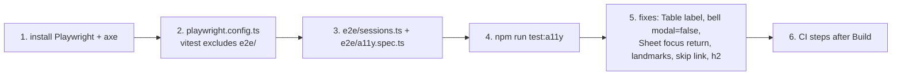

# Recipe: Step 27, Accessibility audit

## What this step is for

An automated accessibility check of every screen (axe inside a real Chromium browser, driven by Playwright), fixes for everything serious or critical it found, a few cheap best-practice fixes, and automated keyboard and focus checks. The owner chose to run it in CI in this step. The full story, including the dead ends, is in `docs/BUILD-LOG.md`'s Step 27 section. How it all works is in [`docs/ACCESSIBILITY.md`](../ACCESSIBILITY.md).

## Diagram



## Checklist

1. **Dependencies** (owner-approved):
   ```sh
   npm install -D @playwright/test @axe-core/playwright
   npx playwright install chromium
   ```

2. **`playwright.config.ts`** at the repo root: `testDir: "./e2e"`, and projects `mobile` (`viewport: { width: 360, height: 780 }`) and `desktop` (`{ width: 1280, height: 800 }`), both built on `devices["Desktop Chrome"]`. `webServer.command` is `npm run start -- --port 3100` with `url: http://localhost:3100`, and `baseURL` matches. `reuseExistingServer: !process.env.CI`. It tests the production build, so you must build first.

3. **`vitest.config.ts`**: add `exclude: [...configDefaults.exclude, "e2e/**"]` (import `configDefaults` from `vitest/config`). Without this, `npm test` picks up `a11y.spec.ts`.

4. **`package.json`**: add the script `"test:a11y": "npm run build && playwright test"` after `test`.

5. **`.gitignore`**: add `/test-results/`, `/playwright-report/`, `/blob-report/` and `/playwright/.cache/`.

6. **`e2e/sessions.ts`**: `PERSONAS` maps `anonymous | super_admin | principal | teacher | parent` to a cookie name and value:
   - `talaan-dev-session` with `staff-0001`, `staff-principal-school-balanga` or `staff-teacher-school-balanga`
   - `talaan-parent-session` with `parent-balanga-1`

   `signInAs(context, persona, baseURL)` calls `context.addCookies`. `previewThemePreset` sets `talaan-theme-override`.

7. **`e2e/a11y.spec.ts`**:
   - `expectNoBlockingViolations(page)` does three things:
     1. Waits for every finite animation to finish (`getAnimations()`, ignoring `iterations === Infinity`).
     2. Runs `new AxeBuilder({ page }).withTags(["wcag2a","wcag2aa","wcag21a","wcag21aa","wcag22aa"])`.
     3. Fails on `serious`/`critical`, and annotates the rest.
   - A `SCREENS` list (19 entries: name, path, persona), looped for `colorScheme` `light` and `dark` via `test.use({ colorScheme })`.
   - One test per theme preset: login, then dashboard as principal.
   - `"interactive states"`:
     - The mobile nav drawer (skipped on desktop).
     - Add student before and after an empty submit (assert `:focus` has `aria-invalid="true"`).
     - The Edit student drawer and "Card lost? Replace it".
     - The Add school drawer.
     - The four tap station buttons. After each, wait for "Simulate offline" to be enabled again.
     - Parent login and link-a-child errors.
     - The notification bell (`getByRole("menu")` visible).
   - `"keyboard and focus"`:
     - The skip link is the first Tab stop and Enter focuses `main` (principal and parent).
     - 25 Tabs inside the Add student drawer stay inside `[role=dialog]`.
     - Esc returns focus to the Add student button, and then to a table row's Edit button.
     - The mobile nav returns focus to its trigger.
     - The station buttons are at least 44px tall.

8. **Run it**: `npm run test:a11y`. The first run fails on `scrollable-region-focusable` for Attendance and Staff at 360px.

9. **Fix: labelled tables.** In `src/components/ui/table.tsx`, `Table` takes `label?: string`. The container gets `role={label ? "region" : undefined}`, `aria-label={label}`, `tabIndex={label ? 0 : undefined}` and `rounded-[inherit] outline-none focus-visible:ring-2 focus-visible:ring-ring/50 focus-visible:ring-inset`. Pass `label` in `attendance-table.tsx` ("Attendance"), `class-roll.tsx` ("Class roll"), `schools-table.tsx` ("Schools"), `staff-table.tsx` ("Staff") and `students-table.tsx` ("Students").

10. **Fix: bell menu.** In `src/features/parents/notifications-bell.tsx`, use `<DropdownMenu modal={false}>`, with a comment explaining why.

11. **Fix: drawers return focus.** In `src/components/ui/sheet.tsx`, `SheetContent` pulls out `onOpenAutoFocus`/`onCloseAutoFocus` and keeps `openerRef = React.useRef<HTMLElement | null>(null)`:
    - `onOpenAutoFocus` stores `document.activeElement` and calls the caller's handler.
    - `onCloseAutoFocus` calls the caller's handler. Then, unless the event was already prevented or the opener is gone, it calls `event.preventDefault()` and `opener.focus()`.

12. **Fix: skip link and landmarks.**
    - New `src/components/skip-link.tsx`, exporting `MAIN_CONTENT_ID = "main-content"` and `SkipLink`. Its classes are `sr-only … focus:not-sr-only focus:fixed focus:px-4 focus:py-2.5 focus:top-3 focus:left-3 focus:z-50`. Padding must be `focus:`-prefixed, or `not-sr-only`'s `padding: 0` wins.
    - Render `<SkipLink />` first inside `AppShell` and inside `src/app/parent/(protected)/layout.tsx`. Give each layout's `<main>` `id={MAIN_CONTENT_ID} tabIndex={-1}` and `outline-none`.
    - In `src/app/page.tsx`, `src/app/parent/login/page.tsx`, `src/app/parent/signup/page.tsx` and `src/app/not-found.tsx`, change the outermost `<div>` to `<main>`.
    - In `sidebar.tsx`, change `Sidebar`'s root `<div>` to `<aside aria-label="Sidebar">`.
    - In `child-summary-card.tsx`, change the child's name from `<p>` to `<h2>`, with the same classes.

13. **CI**: after `Build` in `.github/workflows/ci.yml`, add these steps:
    1. `npx playwright install --with-deps chromium`
    2. `npx playwright test`
    3. `actions/upload-artifact@v4` with `playwright-report/`, run under `if: failure()`.

14. **Verify**: run `npm run test:a11y` (expect 118 passed, 2 skipped), then `lint`, `typecheck`, `check:tokens` and `test`. Screenshot the skip link (press Tab once on `/dashboard`) and a focused table at 360px and 1280px, in light and dark.
