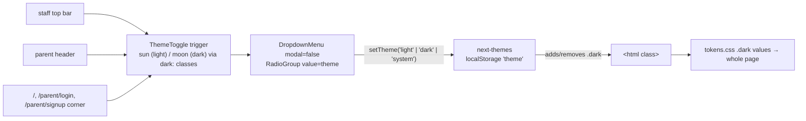

# Recipe: Step 27.5, Light and dark mode toggle

## What this step is for

A visible light/dark control, which the plan had missed. A sun/moon icon opens a menu with Light, Dark and Match device, the default. It sits in the staff top bar at every width, in the parent header and in the corner of the three login pages. The choice is saved per browser by next-themes. The full story is in `docs/BUILD-LOG.md`'s Step 27.5 section, and the mechanism is in `docs/STYLING-SYSTEM.md` section 5.

## Diagram

## Checklist

1. **`src/components/theme-toggle.tsx`**: replace the file, keeping the `ThemeToggle` export.
   - Define `MODES`: `light`/"Light"/`Sun`, `dark`/"Dark"/`Moon`, `system`/"Match device"/`Monitor`.
   - `const { theme, setTheme } = useTheme()`.
   - Render `<DropdownMenu modal={false}>` with:
     - A trigger: `<Button variant="ghost" size="icon-lg" aria-label="Light or dark mode">` holding `<Sun className="dark:hidden" />` and `<Moon className="hidden dark:block" />`, both `aria-hidden`.
     - Content with `align="end" className="w-44"`: a `DropdownMenuLabel` reading "Light or dark", then `DropdownMenuRadioGroup value={theme ?? "system"} onValueChange={setTheme}`, with one `DropdownMenuRadioItem` per mode (icon `text-muted-foreground` plus label).
   - No `mounted` state and no `useEffect`: the CSS picks the icon, so the server and client HTML match.

2. **Staff top bar** (`src/components/app-shell/topbar.tsx`): import `ThemeToggle`. Before the `hidden sm:flex` group, add `
<ThemeToggle />
`, and remove `ml-auto` from that group.

3. **Parent header** (`src/app/parent/(protected)/layout.tsx`): import it, and render `<ThemeToggle />` first inside `
`, before `NotificationsBell`.

4. **Login pages** (`src/app/page.tsx`, `src/app/parent/login/page.tsx`, `src/app/parent/signup/page.tsx`): import it, add `relative` to `<main>`, and put `
<ThemeToggle />
` as its first child.

5. **Audit tests** (`e2e/a11y.spec.ts`): add a `"light and dark mode toggle"` describe block:
   - For `/dashboard` (principal), `/parent` (parent) and `/` (anonymous): open the "Light or dark mode" button, expect a `menu`, and run `expectNoBlockingViolations`.
   - Keyboard test: focus the trigger, press Enter, focus the `menuitemradio` "Dark", press Enter, and expect `html` to have class `dark`. Reload and expect it still. Reopen and expect "Dark" checked. Click "Match device" and expect no `dark` class.

6. **Docs**: rewrite `docs/STYLING-SYSTEM.md` section 5 for the new component (remove the `mounted` explanation) and update the diagram label.

7. **Verify**: run `npm run build` then `npx playwright test` (expect 126 passed, 2 skipped), plus `lint`, `typecheck`, `check:tokens` and `test`. Look at `/dashboard`, `/parent` and `/` at 360px and 1280px, in light and dark, with the menu open.
