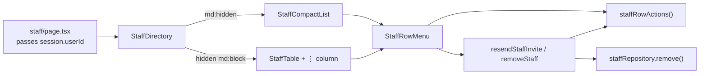

# Recipe: Step 27.6, Mobile staff list and drawer

## What this step is for

Below 768px the Staff table becomes a compact list, about 64px per person: name, one line saying what they do, an "Invited" tag only when pending, and a ⋮ menu. Nothing scrolls sideways on a phone. The ⋮ menu (the email on phones, then Resend invitation and Remove with confirmation) appears on both the list and the table. Red buttons now fill solid on hover, for contrast. The invite drawer fills a phone's width and shows every field. The full story, including the first card-based version the owner rejected as too tall and the hover-contrast bug, is in `docs/BUILD-LOG.md`'s Step 27.6 section. The pattern itself is in `docs/RESPONSIVE-LISTS.md`.

## Diagram

## Checklist

1. **`src/data/repositories/staff-repository.ts`**:
   - Add `remove(id: string): Promise<void>` to `StaffRepository`.
   - In the mock: `simulateLatency`, then `findIndex` and `splice` if found.
   - Add two tests to `staff-repository.test.ts`: it removes, and an unknown id is ignored.

2. **`src/features/staff/row-actions.ts`**:
   - `staffRowActions(staff, currentUserId)` returns `{ canResend: staff.status === "invited", canRemove: staff.id !== currentUserId }`.
   - Add `row-actions.test.ts` with two tests.

3. **`src/features/staff/actions.ts`**:
   - Add the `StaffRowActionResult` type (`{ ok: true } | { ok: false; error: string }`).
   - Add a private `findActionTarget(staffId)`, which refuses no school, a teacher, or a missing or other-school staff member.
   - Add `resendStaffInvite(id)`: it checks `canResend` and returns ok (no email in Phase 1).
   - Add `removeStaff(id)`: it checks `canRemove`, then calls `staffRepository.remove` and `refresh()`.

4. **`src/features/staff/staff-display.tsx`**: move `ROLE_LABEL` here from the table, and add:
   - `staffName`.
   - `advisoryLabel`: `"Grade N – Section"`, or null.
   - `staffSummary`: `"Adviser, <advisory label>"` when there's a class, otherwise `ROLE_LABEL[role]`.
   - `StaffAvatar({ staff, className })`: `aria-hidden`, `size-9` by default.

5. **`src/features/staff/staff-row-menu.tsx`** (client):
   - The trigger is a ghost `size="icon"` button labelled `Actions for <name>`, containing `MoreVertical`.
   - `DropdownMenu modal={false}`, with content `align="end" className="w-60"`. It starts with a phone-only email label (`DropdownMenuLabel className="font-normal wrap-anywhere text-muted-foreground md:hidden"`) and a `DropdownMenuSeparator className="md:hidden"`, then holds a Resend item (only if `canResend`), a separator (only if both) and a destructive Remove item (only if `canRemove`). Items get `py-2.5 md:py-1`.
   - Return `null` when neither action is allowed.
   - Remove sets `confirmOpen`, which opens a `Dialog`: title "Remove <name>?", Cancel (outline) and Remove (destructive, showing "Removing…" while pending).
   - `onCloseAutoFocus`: always `preventDefault()`. Focus `#main-content` if the removal succeeded (tracked in `removedRef`), otherwise the trigger.

6. **`src/features/staff/staff-compact-list.tsx`**:
   - A `<ul aria-label="Staff" className="divide-y divide-border rounded-lg border border-border bg-card">`.
   - Each `<li className="flex min-h-16 items-center gap-3 py-2 pr-1 pl-4">` holds:
     - `StaffAvatar className="size-10"`.
     - A text column `min-w-0 flex-1 py-1` containing:
       - `<h3 className="text-sm leading-snug font-semibold wrap-break-word text-foreground">` with the name.
       - A `mt-0.5 flex flex-wrap items-center gap-x-2 gap-y-1` row holding the `text-sm text-muted-foreground` `staffSummary` and, only when `status === "invited"`, `<StaffStatusBadge className="px-2 py-0.5" />`.
     - A fixed `flex size-11 shrink-0 items-center justify-center` box holding `StaffRowMenu className="size-11"`.
   - No email and no column labels. The email lives in the menu.

7. **`staff-table.tsx`**:
   - Use the shared helpers.
   - Add `currentUserId` to the props.
   - Add a last `<TableHead className="w-12">Actions</TableHead>` and a matching `<TableCell className="text-right"><StaffRowMenu …/></TableCell>`.

8. **`staff-directory.tsx`**:
   - Add the `currentUserId` prop.
   - Render `
<StaffCompactList/>
` and `
<StaffTable/>
`.
   - In **`page.tsx`**, pass `currentUserId={session.userId}`.

9. **`staff-drawer.tsx`**: change the `SheetContent` class to `flex flex-col gap-0 data-[side=right]:w-full`. The plain `w-full` and `sm:max-w-md` never beat the Sheet's `data-[side=right]:` rules.

10. **`staff-form.tsx`**:
    - Both field pairs become `grid grid-cols-1 gap-4 sm:grid-cols-2 sm:gap-3`.
    - Legends get `mb-3`, except "Advisory class (optional)", which gets `mb-1`.
    - Replace the helper paragraph with `AdvisoryHint`: "Can be assigned later." plus a ghost `icon-sm` `Info` button (`aria-expanded`, `aria-controls` from `useId`) toggling a `hidden` paragraph with the longer sentence.
    - Give the `SheetFooter` the extra classes `[&>button]:h-11 [&>button]:flex-1 sm:[&>button]:h-8 sm:[&>button]:flex-none`.

11. **`staff-compact-list.test.tsx`**:
    - Mock `./actions` and stub `ResizeObserver`, as in `notifications-bell.test.tsx`.
    - Six tests:
      - The name and summary appear with no "Role" label.
      - The "Teacher" fallback when there's no class.
      - "Invited" is shown but "Active" is not.
      - The email is absent until the menu opens, and the menu has Resend and Remove.
      - No menu on your own account.
      - Remove opens the "Remove …?" dialog.
    - Open the menu with `fireEvent.pointerDown(trigger, { button: 0, ctrlKey: false })`.

12. **`e2e/a11y.spec.ts`**:
    - In "interactive states", add "staff row menu and remove confirmation": open "Actions for Jose Pascual", run axe, click Remove, run axe on the dialog, then Cancel and expect the trigger to be focused.
    - Add a "small screens" group, mobile project only: at `/staff` the list is visible, the table is hidden, and `scrollWidth <= clientWidth`.

13. **`src/components/ui/button.tsx`**: in the `destructive` variant, replace `hover:bg-destructive/20` with `hover:bg-destructive hover:text-destructive-foreground`, and delete `dark:hover:bg-destructive/30`. Add a comment giving the measured 4.12:1 and 3.87:1.

14. **Verify:**
    - `npm run lint && npm run typecheck && npm run check:tokens && npm test && npm run build`, then `npx playwright test`.
    - Manually invite a very long name and email, and check 320, 375, 390, 428, 768 and 1280px in light and dark.
