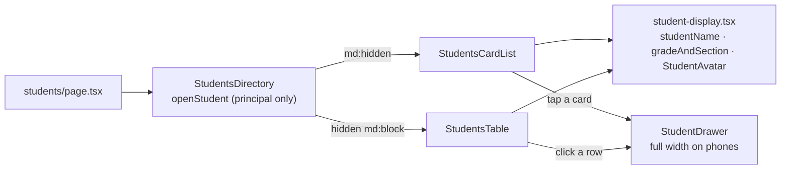

# Recipe: Step 27.7, Mobile students cards

## What this step is for

Below 768px the Students table becomes cards: initials, name, "Grade 12 – Silang" (or today's time in, for a teacher), today's status on the right, and a card tag only for "No card" or "Lost". Tapping a card opens the edit drawer. The search box, filters, pagination and page header are sized for a thumb, and the add/edit drawer fills a phone's width. Staff switches from its divided list to the same cards. What was taken from the owner's sample mockup, and why, is in `docs/RESPONSIVE-LISTS.md` section 3. The full story, including the grid bug in the page header, is in `docs/BUILD-LOG.md`'s Step 27.7 section.

## Diagram

## Checklist

1. **`src/features/students/student-display.tsx`** (new): `studentName(student)`, `gradeAndSection(student)` returning `"Grade N – Section"`, and `StudentAvatar` (initials, `aria-hidden`, `size-9` by default).

2. **`src/features/students/students-table.tsx`**: delete the local `initials()` and use `StudentAvatar`, `studentName` and `gradeAndSection` instead.

3. **`src/features/students/students-card-list.tsx`** (new), props `items`, `taps`, `subtitle: "grade" | "time-in"` and optional `onCardClick`:
   - The list is `<ul aria-label="Students" className="flex flex-col gap-2">`.
   - Each card is `<li className="relative flex min-h-16 items-center gap-3 rounded-lg border border-border bg-card px-4 py-3">`. When clickable, add `hover:bg-muted/50 active:bg-muted has-focus-visible:border-ring has-focus-visible:ring-2 has-focus-visible:ring-ring/50`.
   - Inside: `StudentAvatar` at `size-10`, then a `min-w-0 flex-1` column holding the `<h3 className="text-base leading-snug font-semibold wrap-break-word">` and the subtitle `
`.
   - When clickable, the `<h3>` holds `<button type="button" aria-label="Edit {name}" className="text-left outline-none after:absolute after:inset-0 after:rounded-lg">`. That stretches the button over the whole card and keeps the name a heading.
   - Subtitle: `gradeAndSection()`, or for `time-in`, `In at ${formatTapTime(tap.tappedAt)}` or "No tap yet".
   - Right column: `StatusPill`, then `CardStatusBadge` (`px-2 py-0.5`) only when `cardStatus !== "active"`.

4. **`src/features/students/students-card-list.test.tsx`** (new), 5 tests:
   - Name, grade and status, with no LRN, age or guardian.
   - A tag only when the card isn't linked.
   - A teacher sees the time in.
   - Clicking calls `onCardClick` with the row.
   - No buttons when it's read-only.

5. **`src/features/students/students-directory.tsx`**:
   - Add `const openStudent = canEdit ? (row) => setDrawer({ open: true, student: row.student, cards: row.cards }) : undefined`.
   - Render `
<StudentsCardList … subtitle={showGradeFilter ? "grade" : "time-in"} onCardClick={openStudent} />
` and `
<StudentsTable … onRowClick={openStudent} />
`.
   - The header button becomes `<Button aria-label="Add student">` with `Addstudent`.

6. **`src/features/students/students-toolbar.tsx`**:
   - Wrapper: `cn("grid gap-3 sm:flex sm:flex-wrap sm:items-center", showGradeFilter ? "grid-cols-2" : "grid-cols-1")`.
   - Search wrapper: `col-span-full sm:w-72`. Search input: `h-11 pl-8 sm:h-8`.
   - Both select triggers: `FILTER_TRIGGER_CLASS = "w-full data-[size=default]:h-11 sm:w-fit sm:data-[size=default]:h-8"`. It has to be `data-[size=default]:h-11`, not `h-11`, or the trigger's own `data-[size=default]:h-8` wins.

7. **`src/features/students/students-pagination.tsx`**:
   - Wrapper: `flex flex-wrap items-center justify-between gap-3`.
   - The count text: `Showing {start}–{end} of {total} student(s)`.
   - Page buttons: `size-11 … sm:size-8`.

8. **`src/components/page-header.tsx`**:
   - Replace the flex stack with `grid grid-cols-[minmax(0,1fr)_auto] items-center gap-x-3 gap-y-1`.
   - Heading: `col-start-1 row-start-1 … wrap-break-word`.
   - Description: `col-span-2 col-start-1 row-start-2 sm:col-span-1`.
   - Actions: `col-start-2 row-start-1 sm:row-end-3`.
   - **Dead end:** `sm:row-span-2` instead of `sm:row-end-3` puts the description top right on desktop, because `row-span-*` resets `row-start`. See the build log.

9. **Other header buttons**: in `staff-directory.tsx` it becomes `aria-label="Invite staff"` with `Invitestaff`, and in `schools-directory.tsx` `aria-label="Add school"` with `Addschool`.

10. **Student drawer**:
    - `student-drawer.tsx`: `SheetContent className="flex flex-col gap-0 data-[side=right]:w-full data-[side=right]:sm:max-w-md"`.
    - `student-form.tsx`: the three `grid grid-cols-2 gap-3` become `grid grid-cols-1 gap-4 sm:grid-cols-2 sm:gap-3`. The footer gets `[&>button]:h-11 [&>button]:flex-1 sm:[&>button]:h-8 sm:[&>button]:flex-none`.
    - `student-form.tsx` and `card-box.tsx`: legends get `mb-3`.

11. **`src/features/staff/staff-compact-list.tsx`**:
    - The `<ul>` becomes `flex flex-col gap-2`, and each `<li>` gets `rounded-lg border border-border bg-card`, dropping `divide-y` and the outer border.
    - The name goes from `text-sm` to `text-base`.

12. **`e2e/a11y.spec.ts`**: the "small screens" test becomes a loop over `LIST_PAGES = [{ path: "/staff", list: "Staff" }, { path: "/students", list: "Students" }]`, and also calls `expectNoBlockingViolations(page)`.

13. **Verify**:
    - `npm run lint`, `npm run typecheck`, `npm test`, `npm run check:tokens` and `npm run build`.
    - `npx next start -p 3100`, then `npx playwright test` (it reuses the server on 3100).
    - Look at `/students` at 320, 360 and 375px and at 1280px, in light and dark, as a principal and as a teacher.

## Commit

`feat(students): show students as cards on small screens`
