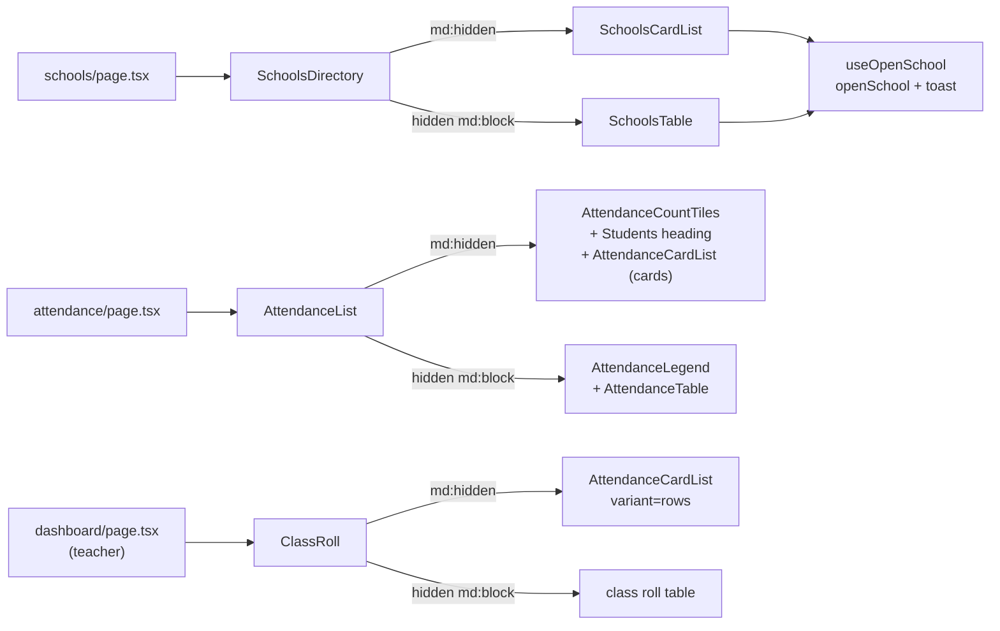

# Recipe: Step 27.8, Mobile cards everywhere else

## What this step is for

Below 768px, the last lists that scrolled sideways become cards. Schools gets one card per school that opens it when tapped. Attendance follows the owner's second sample phone screen (layout only, in this app's styling): a full-width date with grade and section beside each other, four count tiles, a "Students · N total" heading, and cards with the status and time in on the right. The teacher dashboard's class roll uses the same layout as divided rows inside its panel. The Add school drawer fills a phone's width with thumb-sized buttons. Every border without its own color now uses the light border token instead of the text color. What was taken from the sample, and why, is in `docs/RESPONSIVE-LISTS.md` section 3. The full story, including how every page was measured first, is in `docs/BUILD-LOG.md`'s Step 27.8 section.

## Diagram



## Checklist

1. **Measure first.** Run `npm run build`, then `npx next start -p 3100`. A throwaway Playwright script visits every screen as every role at 320, 360 and 375px, and logs:
   - `scrollWidth` against `clientWidth` on `<html>`;
   - every `overflow-x: auto|scroll` element whose `scrollWidth > clientWidth`;
   - any element whose right edge passes the viewport.

   That found Attendance and Schools scrolling inside their boxes, and nothing else.

2. **`src/styles/base.css`**, inside `@layer base`:
   ```css
   *, ::after, ::before, ::backdrop, ::file-selector-button {
     border-color: var(--border);
   }
   ```
   First scan `src/**/*.tsx` for class strings with a border width and no border color. Only `dialog.tsx`, `sheet.tsx` and `table.tsx` should turn up.

3. **`src/features/schools/use-open-school.ts`** (new, `"use client"`): `useOpenSchool(schoolId)` returns `{ isPending, open }`. `open` runs `openSchool(schoolId)` in a transition and calls `toast.error(result.formError)` when `!result.ok`.

4. **`schools-table.tsx`**: `OpenSchoolButton` becomes `const { isPending, open } = useOpenSchool(schoolId)` with `<Button variant="outline" size="sm" disabled={isPending} onClick={open}>`. Drop the `useTransition`, `toast` and `openSchool` imports.

5. **`src/features/schools/schools-card-list.tsx`** (new, `"use client"`):
   - `schoolCounts(students, staff)` returns `"36 students · 4 staff"`, with "1 student" in the singular.
   - `SchoolCard` is an `<li className="relative flex min-h-16 items-center gap-3 rounded-lg border border-border bg-card py-3 pr-1 pl-4 … has-focus-visible:ring-2">`. Inside it go:
     - `SchoolLogo` at `size-10`.
     - An `<h3>` holding a stretched `<button aria-label="Open {name}">` (`"Opening {name}…"` and `disabled` while pending).
     - The counts line, plus a `BellOff` "Notifications off" tag (`bg-status-idle-bg text-status-idle`) only when `notificationPreference === "off"`.
     - An `aria-hidden` `size-11` box holding `ChevronRight`, or `Loader2` while pending.
   - `SchoolsCardList` is a `<ul aria-label="Schools" className="flex flex-col gap-2">`.

6. **`schools-directory.tsx`**: `<div className="md:hidden"><SchoolsCardList/></div>` and `<div className="hidden md:block"><SchoolsTable/></div>`.

7. **`school-drawer.tsx`**: `SheetContent className="flex flex-col gap-0 data-[side=right]:w-full"`.

8. **`school-form.tsx`**:
   - Legends: `mb-3` on "School details", `mb-2` on "Logo (optional)", `mb-1` on "Colors" and "Principal" (each followed by a description).
   - The name pair: `grid grid-cols-1 gap-4 sm:grid-cols-2 sm:gap-3`.
   - Footer: `[&>button]:h-11 [&>button]:flex-1 sm:[&>button]:h-8 sm:[&>button]:flex-none`.

9. **`src/features/attendance/attendance-card-list.tsx`** (new). Props are `rows`, `taps`, `now?`, `label` and `variant: "cards" | "rows"`.
   - `<ul aria-label={label}>`, with `gap-2` for cards or `divide-y divide-border` for rows.
   - Each `<li>`: for cards, `min-h-16 rounded-lg border border-border bg-card px-4 py-3`; for rows, `py-3 first:pt-0 last:pb-0`.
   - Left: `StudentAvatar` at `size-10`, then an `<h4>` with `studentName()`, and a `CardStatusBadge` (`mt-1 px-2 py-0.5`) only when `cardStatus !== "active"`.
   - Right (`flex shrink-0 flex-col items-end gap-1`): the `StatusPill`, then a `<p>` holding `<span className="sr-only">In at </span><time>`. With no tap, it holds `<span aria-hidden>—</span><span className="sr-only">No tap yet</span>`.

10. **`segmented-bar.tsx`**: add `AttendanceCountTiles`.
    - A `<dl className="grid grid-cols-2 gap-2">`.
    - Per status, a `<div className="grid grid-cols-[auto_minmax(0,1fr)] items-center gap-x-3 rounded-lg border … px-4 py-3">` holding:
      - the dot (`col-start-1 row-start-1 row-end-3`);
      - `<dt className="col-start-2 row-start-2">`;
      - `<dd className="col-start-2 row-start-1 font-heading text-2xl …">`.
    - **Dead end avoided:** don't wrap `dt` and `dd` in an inner `div` to stack them, because axe's `dlitem` rule fails. Place them with the grid instead.

11. **`src/features/attendance/attendance-list.tsx`** (new): `md:hidden` tiles, `hidden md:block` legend, a `md:hidden` `<section aria-labelledby="attendance-students-heading">` (uppercase `<h3>` "Students" plus "N total", then `AttendanceCardList label="Students"`), and a `hidden md:block` table.

12. **`attendance/page.tsx`**: `const now = \`${date}T09:15:00Z\``, then `body = <AttendanceList rows taps now counts={countByStatus(classStudents, taps, now)} />`.

13. **`attendance-table.tsx`**: delete `initials()`. Use `<StudentAvatar student={student} />` and `studentName(student)`.

14. **`attendance-toolbar.tsx`**:
    - Wrapper: `cn("grid gap-3 sm:flex sm:flex-row sm:flex-wrap sm:items-end", showClassPicker ? "grid-cols-2" : "grid-cols-1")`.
    - Date label: `col-span-full`. The input gets `h-11 sm:h-8 sm:w-44`.
    - Grade and section wrappers get `min-w-0`. Their triggers get `cn(FIELD_TRIGGER_CLASS, "sm:w-36")` and `cn(FIELD_TRIGGER_CLASS, "sm:w-44")`, where `FIELD_TRIGGER_CLASS = "w-full data-[size=default]:h-11 sm:data-[size=default]:h-8"`.

15. **`class-roll.tsx`**: the props become `{ rows: AttendanceRow[]; taps }`. It renders `<div className="md:hidden"><AttendanceCardList variant="rows" label="Class roll" /></div>`, then the old table in `hidden md:block`, using `StudentAvatar` and `studentName`. The table's second line is "In at 7:56 AM", or, when `cardStatus !== "active"`, a `CardStatusBadge` (`mt-1 px-2 py-0.5`) in place of the old "No ID card linked yet" (owner review), otherwise "No tap yet". `class-roll.test.tsx` checks all four rows.

16. **`dashboard/page.tsx`** (teacher branch): replace `getActiveForStudent` and the `studentIdsWithoutCard` set with `cardRepository.listByStudent` plus `deriveCardStatus`, building `rollRows`. Pass `<ClassRoll rows={rollRows} taps={classTaps} />`.

17. **Tests**:
    - `schools-card-list.test.tsx` (4 tests). Mock `./actions`, with `openSchool` returning a promise that never settles, so the pending state can be checked.
    - `attendance-card-list.test.tsx` (5 tests) and `class-roll.test.tsx` (1 test, the desktop table's tags).
    - `e2e/a11y.spec.ts`: each `LIST_PAGES` entry gets an `as` role, plus `/attendance` (principal and teacher, list "Students"), `/schools` (super admin, "Schools") and `/dashboard` (teacher, "Class roll").

18. **Verify**:
    - `npm run lint`, `npm run typecheck`, `npm test`, `npm run check:tokens` and `npm run build`.
    - `npx next start -p 3100`, then `npx playwright test`: 134 passed, 8 skipped.
    - Re-run the measuring script (57 checks, all clean) and screenshot the changed pages at 320, 360, 375 and 1280px in light and dark.
    - Stop the server: `netstat -ano | grep :3100`, then `taskkill //PID <pid> //F`.

## Commit

`feat(ui): show lists as cards on small screens`
